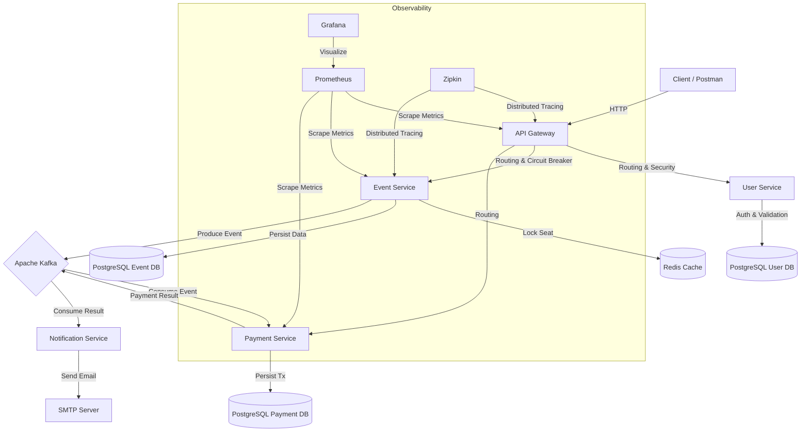

# 🎟️ Cloud-Native Ticket Booking System

A highly scalable, **Event-Driven Microservices** application built with **Spring Boot 3** and **Kubernetes**.
This project demonstrates advanced patterns like **SAGA (Choreography)**, **Distributed Locking (Redis)**, **Resilience (Circuit Breaker)**, and **Observability**.

---

## 🏛️ Architecture Overview

The system follows a microservices architecture where each service has its own database (**Database per Service** pattern) and communicates asynchronously via **Kafka**.

🚀 Key Features & Patterns
Feature	Technology / Pattern	Description
Service Discovery	Netflix Eureka	Dynamic service registration and discovery.
API Gateway	Spring Cloud Gateway	Centralized entry point, routing, and rate limiting.
Authentication	JWT & Spring Security	Stateless security mechanism protecting internal services.
Event-Driven	Apache Kafka	Asynchronous communication between services.
Concurrency Control	Redis Distributed Lock	Prevents double-booking of the same seat.
Resilience	Resilience4j	Circuit Breaker pattern to handle service failures gracefully.
Data Consistency	SAGA Pattern	Handles distributed transactions (Compensating transactions).
Observability	Prometheus & Grafana	Real-time metrics monitoring and visualization.
Tracing	Zipkin & Micrometer	Distributed tracing to debug latency and flow issues.
Containerization	Docker	Fully containerized environment for all services.
Orchestration	Kubernetes (Minikube)	Deployment, scaling, and management of containers.
CI/CD	GitHub Actions	Automated build, test, and deploy pipeline to Docker Hub.